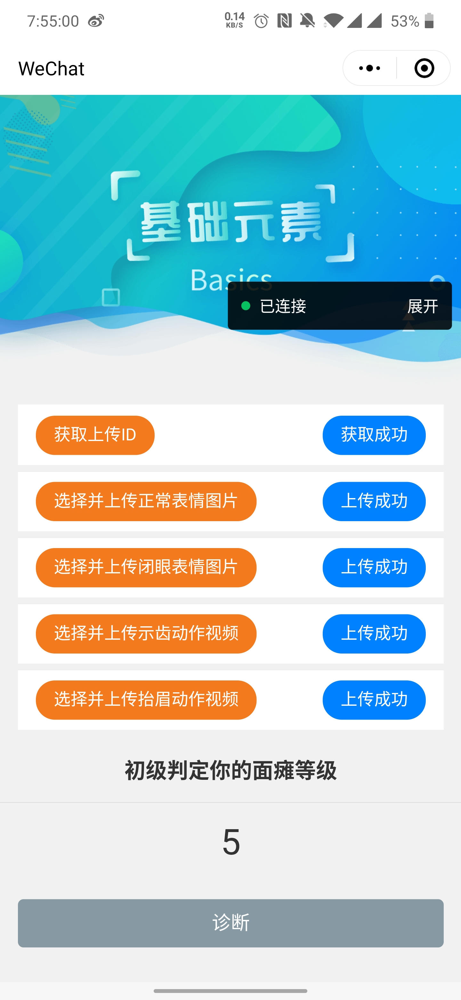

# DiagnoseSCU
🪐基于自动人脸分析的“智能面瘫诊断助手”，机器学习项目✔，采集人脸数据诊断面瘫等级🗡，微信小程序测试中⌛

---
本项目旨在研发一款 APP，用以辅助中医在进行面瘫诊断时，记录面部图像 /视频、自动分析面部特征、对相关病症做出自动评估与分析。首先调用手机摄 像头拍摄病人面部图像或视频，检测出人脸区域，定位面部关键特征点(如眼角、 嘴角、鼻翼点等)，提取面部特征，然后利用训练样本训练分类器，对病人的病 症做出分类。帮助患者判断自身面瘫严重程度，了解病情治疗状况，同时辅助医 生进行治疗，提高诊断效率。

---
#### 配置项目跑在服务器上

（项目如果想要跑在服务器上，特别是供微信小程序使用的话，非常麻烦，我配了整整4天，每晚2点睡，最后还是以一种投机的方法跑成功了）如果配置项目跑在服务器上，这里列出我在配置的时候查找的几篇文章，可能会有帮助，但是跟着博客做也可能会出现配不好的情况

- https://blog.csdn.net/k295330167/article/details/80616519

- https://www.fujieace.com/jingyan/vc11-vc14-vc15.html

- https://blog.csdn.net/dyingstraw/article/details/82698639#2.%E5%AD%90%E5%9F%9F%E5%90%8Dssl%E8%AF%81%E4%B9%A6%E7%94%B3%E8%AF%B7

- https://blog.csdn.net/sunroyi666/article/details/82454523

- https://cloud.tencent.com/developer/article/1356570

- https://blog.csdn.net/yushupan/article/details/85061143

---

项目概述

- Util.py 
  算法的核心代码，都封装成了函数写在里面，运行需要配置dlib、opencv、scimage、matplotlib等包（注意各种版本问题）
  
- test.py
  服务端代码，需要配合apache使用，本地运行请跑app.py

- app.py
  服务端代码，直接运行，访问http://localhost:9004即可

- testUtil.py
  测试后台算法能不能使用的类，需要传入2张图片，2个视频，放在同一目录下
  
 
小程序初级版本示意：

